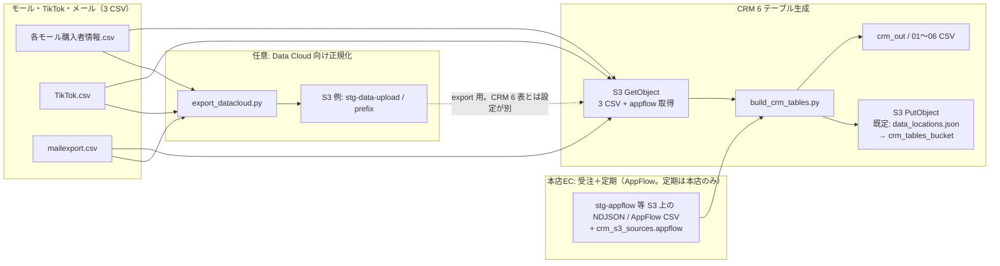
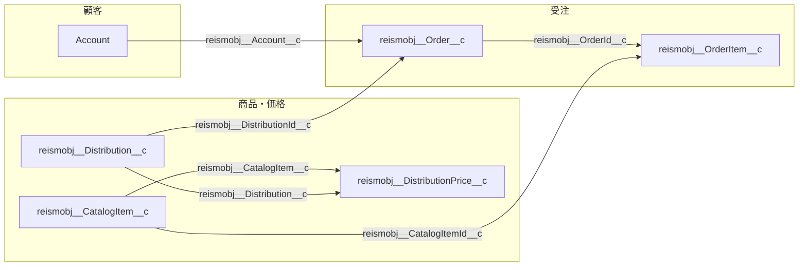

# Data Cloud / CRM データ処理 仕様書

## 1. 概要

`datacloud` 配下では、次の 2 系統の処理を行う。

| 処理 | スクリプト | 主な目的 |
|------|------------|----------|
| **Data Cloud 向け前処理** | `export_datacloud.py` | 和名 CSV の日付 ISO 化・列フィルタ・英語ヘッダー化、任意で S3 へアップロード |
| **CRM 分析用 6 テーブル生成** | `build_crm_tables.py` | 本店ECの**受注・定期**（論理 2）と、モール・TikTok・メール（**3 CSV**）から名寄せ済み 6 CSV を生成。受注・定期は**いずれも** `crm_s3_sources.json` の **`appflow`（`stg-appflow` 等）** から取得。 |

**（ビジネス前提）** 現行では **定期契約（`teiki` ・04 定期購入管理）は本店（EC / Salesforce `Order`）のデータのみ**を扱う。モール・TikTok は **注文明細等のチャネル別取引**として 03 等に載るが、**定期専用の行としては扱わない**。

本書では **全体の位置づけ**と、**CRM 生成（`build_crm_tables.py`）の入出力・処理順・テーブル間キー**を仕様としてまとめる。

### 1.1 データ参照先（`data_locations.json`）

`datacloud_stg` 直下に **`data_locations.json`** を置く（**必須**）。CRM 成果物バケットや Data Cloud 向け export のアップロード先既定など、**環境依存の S3 バケット名をコードではなく JSON で管理**する。初回は `data_locations.sample.json` をコピーして作成する。

| キー | 用途 |
|------|------|
| `crm_tables_bucket` | CRM 6 テーブル成果物の **PutObject** 先（`--s3-output-bucket` 省略時の既定）・**上書き前**の既存成果物 **CopyObject** の元／先・`export_datacloud` がローカル `out` の既存 `*.csv` を退避する **PutObject** 先・`crm_s3_sources.json` で **`brand_mapping_bucket` を省略**したときの商品マッピング JSON の格納バケット既定 |
| `datacloud_export_default_upload_bucket` | `datacloud_requirements.json` の **`s3.bucket` が空または未設定**のとき、`export_datacloud.py --upload-s3` のアップロード先の既定。`--verify-credentials` で S3 HeadBucket を試す際、要件 JSON にバケットが無い場合はこの値をフォールバック候補に使う |

`build_crm_tables.py` と `export_datacloud.py` は起動時にこのファイルを読み、**ファイル欠如・必須キー欠落時はエラー終了**する。

---

## 2. 全体フロー（一連の流れ）

### 2.1 概念図



- **本店/定期**は常に `crm_s3_sources.json` の `appflow` 経由（AWS で `stg-appflow` 等を `GetObject`）。**`ndjson_joined` 時**は CRM 入力用バケット上の `objects.jukkan` / `teiki` に対応するオブジェクトは **GetObject しない**（`fetch_all_crm_source_texts` の仕様）。モール・TikTok・メールの 3 CSV も **`crm_s3_sources.json` の `objects`** で指定したキーを **同一または別バケットから GetObject**（AWS 認証要）。

### 2.2 運用上の流れ（例）

1. **データ配置**  
   **本店/定期**は常に **`crm_s3_sources.json` の `appflow`** 経由。モール・TikTok・メール 3 種は **CRM 入力用 S3**（`crm_s3_sources.json` の `bucket` / `prefix` / `objects`）へ置く。  
   （`objects.jukkan` / `teiki` は **`ndjson_joined` 利用時、CRM バケットから GetObject しない**レガシー用キー。）

2. **（任意）Data Cloud 向け正規化**  
   `export_datacloud.py` が `datacloud_requirements.json` に従い日付正規化・英語ヘッダー化し、`out/` へ出力。`--upload-s3` 時のアップロード先は **`datacloud_requirements.json` の `s3.bucket`**（設定がある場合）。**未設定または空**のときは **`data_locations.json` の `datacloud_export_default_upload_bucket`**（STG では例として `stg-data-upload`）を使う。  
   **CRM 生成とは設定ファイルが別**（`crm_s3_sources.json`）である点に注意。

3. **CRM 6 テーブル生成**  
   `build_crm_tables.py` が本店・定期（**AppFlow 由来 2 論理**）と 3 ソース（モール・TikTok・メール）を扱い、名寄せ・メール集計・解約理由マスタ化を行い、`crm_out/`（`--out-dir`）に **01〜06 の CSV** を出力する。

4. **（既定）CRM 成果物の S3 登録**  
   同一スクリプトが、**既定で** `data_locations.json` の **`crm_tables_bucket`**（サンプルでは `crm-tables` に相当）へ **PutObject**（`--s3-output-bucket` で上書き可。各ファイル名をキーに、任意で `--s3-output-prefix` を前置）。

5. **実行ディレクトリ**  
   `build_crm_tables.py` は **`datacloud` ディレクトリをカレントにして実行**すること（相対パス `crm_s3_sources.json`・`sku_product_name_mapping.json` 等の解決のため）。

6. **出力のバックアップ（上書き前・S3）**  
   - **`build_crm_tables.py`**: 処理開始時に **`s3://<crm_tables_bucket>/<--s3-output-prefix>/`**（`<crm_tables_bucket>` は `data_locations.json`）に **01〜06 の成果物 CSV が既にあれば**、同一バケットの **`backup/YYYY-MM-DD/HHMMSS/`** へ **CopyObject**（S3 内コピー）してから新規出力する。  
   - **`export_datacloud.py`**: **`--out-dir` 直下の既存 `*.csv`** を **`s3://<crm_tables_bucket>/backup/…`** へ **PutObject** する（`<crm_tables_bucket>` は `data_locations.json`）。

---

## 3. コンポーネント一覧

| ファイル | 役割 |
|----------|------|
| `export_datacloud.py` | 和名 CSV の日付正規化・列フィルタ・英語ヘッダー変換、任意 S3 アップロード |
| `column_i18n.py` | 日本語列名 → 英語スネークケース（export 用） |
| `csv_text.py` | バイト列／ファイルの文字コード自動判定デコード |
| `data_locations.py` | `data_locations.json` の読込・必須キー検証（`build_crm_tables` / `export_datacloud` が利用） |
| `data_locations.json` | 環境別 S3 バケット既定（§1.1）。雛形は `data_locations.sample.json` |
| `datacloud_requirements.json` | export 用: 入力ファイル、日付列、`s3` 等 |
| `build_crm_tables.py` | 本店/定期（2 論理。常に `appflow` 経由）＋3 CSV。`format: ndjson_joined` なら NDJSON 全結合、他は `merged_appflow` |
| `name_matching.py` | 顧客 ID 名寄せ、商品名 `product_name_canonical` |
| `crm_s3.py` | 入力: S3 `GetObject`（**`appflow.bucket` あり**のとき `jukkan` / `teiki` キーは **取得スキップ**）。出力: `PutObject`（UTF-8 BOM）、既存成果物の **CopyObject** バックアップ |
| `run_crm_local.py` | **テスト用**: `build_crm_tables.py` を同ディレクトリ前提で起動（S3 入力・プレビュー） |
| `run_output_backup.py` | 実行直前に `out_dir` 直下の既存 `*.csv` を **`s3://<crm_tables_bucket>/backup/日付/時刻/`** へ PutObject（バケットは呼び出し元が `data_locations.json` から渡す。**`export_datacloud`** のみ利用） |
| `appflow_sources.py` | **`appflow.format` が `csv`（既定）** のとき、`stg-appflow` 等から受注・定期相当 **CSV** を取得し縦結合 |
| `reism_appflow_join.py` | **`appflow.format` が `ndjson_joined`** のとき、Account / Order / OrderItem / CatalogItem / DistributionPrice の **NDJSON を全結合**し受注・定期相当 CSV テキストを生成 |
| `appflow_source_mapping.json` | AppFlow 実列名と、本店受注・定期の**論理列名**（jukkan / teiki 中間表現）の対応（省略可・列名同一なら空オブジェクト） |
| `ladder_reism_mapping.csv` | **Ecforce API 概念**（`Name` = `Order_id` 等）と **Salesforce 項目 API 名**（`reismobj__OrderField__c` 等）の対応。`crm_s3_sources.json` の `reism_mapping_csv` でパス指定可（既定: `datacloud/ladder_reism_mapping.csv`）。読み込みは `reism_mapping.py` |
| `reism_to_legacy_column_rules.json` | **AppFlow JSON 項目 → 本店受注・定期の論理列** の対応案（`review` で要確認レベル区分）。`reism_legacy_rules.py` で読込・必須列カバレッジ確認可 |
| `crm_s3_sources.json` | CRM **入力**用: バケット・プレフィックス・オブジェクト論理名、任意の **`reism_mapping_csv`**。`appflow` には **`format`**（`ndjson_joined` / `csv`）、`bucket`、任意 **`subscription_record_type_ids`**（定期 `Order` の `RecordTypeId` リスト）等 |
| `aws_session.py` | boto3 セッション・認証 |
| `sku_product_name_mapping.json` | 任意。商品名完全一致 → 名寄せ表示名 |
| `brand_mapping_from_excel.py` | 商品マッピングマスタ（Excel）→ `brand_mapping.json` 生成（`openpyxl`） |

---

## 4. `export_datacloud.py`（Data Cloud 向け CSV 正規化）

### 4.1 機能の要点

- **入力**: `datacloud_requirements.json` の `sources[]`（`work-dir` 基準パス）。`input_file` 名は設定で定義（例: `ec_orders_input.csv` / `subscription_input.csv`）。
- **処理**: 指定列の日付を ISO 風に正規化、ヘッダーを `column_i18n` で英語化。
- **出力**: `--out-dir`（既定 `datacloud/out/`）。
- **任意**: `--upload-s3` で `datacloud_requirements.json` の `s3` にアップロード（**`s3.bucket` が空のとき**の既定バケットは **`data_locations.json` の `datacloud_export_default_upload_bucket`**）。
- **前提**: `export_datacloud.py` 実行時には **`data_locations.json`**（§1.1）が同ディレクトリに必要（バックアップ先の `crm_tables_bucket` 解決のため）。

### 4.2 主な CLI

| 引数 | 説明 |
|------|------|
| `--config` | 要件 JSON |
| `--work-dir` | 入力基準ディレクトリ |
| `--out-dir` | ローカル出力先 |
| `--upload-s3` | S3 アップロード |
| `--dry-run` | 設定表示のみ |
| `--verify-credentials` | 認証疎通 |

詳細はコードおよび既存コメントを参照。

---

## 5. `build_crm_tables.py`（CRM 6 テーブル）仕様

### 5.1 入力ソース（論理名 → 典型的なファイル名）

- **本店の受注・定期**は **`appflow` のみ**（`reism_appflow_join` 相当）。**定期は本店 `Order` のレコードタイプ等で判別**し、モール・TikTok 取込に定期行は**含めない**（下表・§5.3 参照）。  
- **S3 全体入力**かつ `appflow.format: ndjson_joined` では、CRM 入力用バケット上の `objects.jukkan` / `teiki` は **GetObject されない**（`fetch_all_crm_source_texts`）。`objects` の 2 エントリは**互換用キー**（実キーは使用されない想定）。
- **レガシー: `appflow` 未設定**の S3 入力のみ、従来どおり `jukkan` / `teiki` を `GetObject` する**別運用**が残る（本プロジェクトの既定 `crm_s3_sources` は `appflow` あり想定でその経路に該当しない）。  

| 区分 | 取得方法 |
|------|----------|
| 本店受注 / **本店定期** | 常に `appflow`（`ndjson_joined` または AppFlow CSV 縦結合）。**いずれも** `reismobj__Order__c` 系。定期行は `subscription_record_type_ids` 等で判別。ブランド絞りは主に OrderItem の `ecf_sku__c` 等（本店用） |
| モール / TikTok / メール | チャネル顧客・**単発/モール等の注文**（定期は**対象外**）。**S3** `GetObject`（`crm_s3_sources.json` の `objects` でキー指定） |
| 商品マッピング | ブランド絞り時: `objects.brand_mapping`（S3。`brand_mapping_bucket` 省略時は `data_locations.json` の `crm_tables_bucket`）。`--crm-brand` 省略時の補助に **`--brand-mapping`**（既定 `brand_mapping.json`）の `crm_brand` / `target_brand` を参照可 |

**`appflow.format` が `ndjson_joined` の追加仕様**（`reism_appflow_join.py`）

- **定期行の選定**: `reismobj__Order__c` の **`RecordTypeId` ∈ `appflow.subscription_record_type_ids`**（本プロジェクトでは `012RB00000A1kW5YAJ`）。同一定期番号の複数行は `LastModifiedDate` 最新 1 行。定期番号が空の Order は `Id` で重複排除キーに用いる。
- **02 住所補完**: 論理列に **`ecf_shipping_full_address__c`** を保持。`build_customer_address` は「（住所フル）」が空のとき同フィールドで **住所**を補完（Ecforce 配送先フル表記）。

#### 5.1a `stg-appflow` と Salesforce サンドボックス（オブジェクト／リレーション）

`stg-appflow` の NDJSON は、次の **Salesforce Setup** 組織上のオブジェクトをソースに AppFlow 等でエクスポートしたデータとみなす（オブジェクト API 名・項目の正は Setup で確認）。

- **Setup ベース URL**: [https://enterprise-agility-9382--agentforce.sandbox.my.salesforce-setup.com/](https://enterprise-agility-9382--agentforce.sandbox.my.salesforce-setup.com/)

**主な参照関係**（`reism_to_legacy_column_rules.json` の `object_relationships` と、`reism_appflow_join.py` の結合順と対応）:

| 子オブジェクト | ルックアップ項目 | 親オブジェクト | 親キー | 用途 |
|----------------|------------------|----------------|--------|------|
| `reismobj__OrderItem__c` | `reismobj__OrderId__c` | `reismobj__Order__c` | `Id` | 受注明細 → 注文ヘッダ |
| `reismobj__Order__c` | `reismobj__Account__c` | `Account` | `Id` | 注文 → 顧客（性別・生年月日・会員ランク等） |
| `reismobj__OrderItem__c` | `reismobj__CatalogItemId__c` | `reismobj__CatalogItem__c` | `Id` | 明細 → カタログ商品（SKU 補完等） |
| `reismobj__DistributionPrice__c` | `reismobj__CatalogItem__c` | `reismobj__CatalogItem__c` | `Id` | 価格行 → カタログ商品（同一 CatalogItem に複数行あり得るため ETL で最新 1 行に圧縮） |
| `reismobj__DistributionPrice__c` | `reismobj__Distribution__c` | `reismobj__Distribution__c` | `Id` | 価格行 → 流通 |
| `reismobj__Order__c` | `reismobj__DistributionId__c` | `reismobj__Distribution__c` | `Id` | 注文 → 流通（任意。未設定時は DistributionPrice は主に CatalogItem 経由のみ結合） |



### 5.2 入力モード

| モード | 指定 | 内容 |
|--------|------|------|
| **S3（既定）** | （常時） | 3 CSV＋`appflow` を S3 から取得。`ndjson_joined` なら jukkan/teiki の 2 オブジェクトキーは**スキップ**（§5.1） |
| **S3 かつ `appflow` なし** | （レガシー） | 従来: `objects` の 5 キーすべて GetObject する S3 構成が理論上可能。本件プロジェクト想定外 |

`jukkan` / `teiki` を含むキーは `prefix` + ファイル名（`NoSuchKey` 時は設定と実キーを照合）。**`ndjson_joined` 利用時**は当該 2 つは取得処理から除外される点に注意。

### 5.3 処理パイプライン（実行順）

0. **`s3://<crm_tables_bucket>/<出力プレフィックス>/`**（`<crm_tables_bucket>` は `data_locations.json`）に成果物 CSV があれば `backup/YYYY-MM-DD/HHMMSS/` へ **CopyObject**（`crm_s3.backup_existing_crm_outputs_on_s3`）。失敗時は処理中断。
1. **論理 5 ソースを DataFrame 化**（本店/定期は上記入出力経路を経て 2 DataFrame になる。TikTok は区切り・タブ混在の軽い正規化あり）。
2. **05 解約理由マスタ**  
   `mailexport` のみ使用。「分類１」に **「解約」** を含む行に限定（**注文キャンセル**のみの分類は対象外）。**`お届け日・サイクル・支払方法変更`／`初回キャンセル` を含む分類１は除外**。**`reason_id`** と **分類１を `>` / `＞` で分割した `class1_segment_1`〜`8`** を出力。理由 ID は `CR0001` 形式で採番。
3. **01 顧客マスタ（素地）**  
   本店の受注・**本店定期**・モール・TikTok から顧客行を合成（**定期は本店 `teiki` ソースのみ**）。本店系は更新日ベースで 1 顧客番号 1 行に潰す。モール / TikTok は `MALL_{注文ID}` / `TIKTOK_{注文ID}`（定期チャネルではない）。
4. **メール履歴付与**  
   `mailexport` の From/To から顧客メールを推定し、件数・初回・最終を付与。EC に無いメールは `MAIL_` + ハッシュの顧客番号で行追加。
5. **定期解約フラグ・定期解約理由 ID（01 用）**  
   **本店定期**（`teiki`）の最終行相当（キャンセル／停止理由・ステータス）に加え、**分類１に「解約」を含むメール**のみ突合し、`subscription_cancel_flag`（0/1）と `subscription_reason_id`（05 の `reason_id` と同一コード体系）を付与。**注文キャンセルのみのメール分類は顧客マスタに反映しない。解約済み顧客も除外しない。**
6. **顧客名寄せマップ `_cmap` 算出**  
   `name_matching.build_customer_canonical_id_mapping`（メール → 電話 → 氏名+郵便番号の優先順位でクラスタ、代表 ID へ寄せる）。
7. **01 の `顧客番号` を `_cmap` で置換**し、**同一 `顧客番号` の集約**（`subscription_cancel_flag` はいずれか 1 なら 1、`subscription_reason_id` は先に得られた非空値を優先）。
8. **02 住所** を構築し、`顧客番号` を `_cmap` で置換。
9. **03 注文明細** を構築。本店はソースの `顧客番号`、モールは `MALL_{注文ID}`、TikTok は `TIKTOK_{注文ID}`。その後 **`顧客番号` に `_cmap` を適用**。商品名に `sku_product_name_mapping.json` による `product_name_canonical`。
10. **04 定期購入** を構築。ソースは **本店 `teiki`（AppFlow）のみ**。モール・TikTok から 04 行を作らない。`顧客番号` は定期ソースから。長文を 05 のキー（分類１ベース）へ部分一致で `subscription_reason_id` にマッピング。`**顧客番号` に `_cmap` を適用**。
11. **06 販促** を構築（受注番号ベース）。
12. 各テーブルを **論理名 → 物理名**（`LOGICAL_TO_PHYSICAL`）に変換し、UTF-8 BOM で CSV 出力。
13. **`--s3-output-bucket`（省略時は `data_locations.json` の `crm_tables_bucket`）へ PutObject**（キーは `prefix/ファイル名` またはファイル名のみ）。

### 5.4 出力ファイルと主要列（物理名）

列の完全な対応は `build_crm_tables.py` の `LOGICAL_TO_PHYSICAL` に従う。代表キーは次のとおり。

| ファイル | 主キー／自然キー | 備考 |
|----------|------------------|------|
| `01_顧客マスター.csv` | `customer_no` | 名寄せ後の代表顧客番号。`platform_last_bought`（論理 `顧客タイプ名`）は本店の `顧客タイプ名`、モールは `モール名`、TikTok は `TikTok`（最新スナップショットは `_customer_snapshot_at` で決定、内部列は出力しない）。`platform_first_bought` は販促チャネル（06）と注文明細を受注番号で突合し、**最も古い受注日**の `channel_media` |
| `02_顧客住所配送先.csv` | 行単位（`customer_no` + `ref_no` + `address_type` 等） | `prefecture`（請求先／お届け先）含む。**住所**は従来の「（住所フル）」を優先し、空なら **`ecf_shipping_full_address__c`**（ソースに列がある場合）で補完 |
| `03_注文明細商品.csv` | 行単位（受注の明細行） | `order_source`（ec／mall／tiktok）・`order_type`・`order_status`・`shipping_fee`・`payment_status`・`mall_name` など |
| `04_定期購入管理.csv` | `subscription_no`（定期契約番号・論理名） | `subscription_reason_id`・`subscription_reason_map_text`・`subscription_erp_id`・`sales_channel` など |
| `05_解約理由マスター.csv` | `reason_id` | **`reason_id`** と **`class1_segment_1`〜`8`** |
| `06_販促チャネル.csv` | 行単位 | 本店受注・モール・**TikTok** を縦結合。`purchase_url`・`order_no`（03 と結合可） |

### 5.5 テーブル間の参照関係（結合キー）

| 結合 | 左 | 右 | キー |
|------|----|----|------|
| 顧客 ↔ 住所 | 01 | 02 | `customer_no` |
| 顧客 ↔ 注文明細 | 01 | 03 | `customer_no` |
| 顧客 ↔ 定期 | 01 | 04 | `customer_no` |
| 注文明細 ↔ 販促 | 03 | 06 | `order_no` |
| 顧客・定期 ↔ 解約理由マスタ | 01 または 04 | 05 | 01/04 の `cancel_reason_id` ↔ 05 の **`reason_id`**（列名は異なるが値は同一コード） |

### 5.6 解約理由マスタ（05）の定義（現行）

- **ソース**: `mailexport.csv` のみ。
- **対象行**: 「分類１」に **「解約」** を含む行（**「キャンセル」のみ**の分類は含めない）。**ただし分類１に `お届け日・サイクル・支払方法変更` または `初回キャンセル` を含む行は解約マスタ対象外**（除外）。
- **分類１の階層列 (`class1_segment_1` … `class1_segment_8`)**: 対象の **分類１** ユニーク値ごとに、文字列を **`>` または `＞`** で分割した各セグメントを列に格納（最大 8 階層。足りない階層は空）。内部の `reason_map` キーにも同じ分類１原文を用いる。
- **理由 ID (`reason_id`)**: `CR0001` 形式。

**本店定期**（`teiki`）のキャンセル／停止理由**長文**を、上記 05 マスタの**分類１原文**へ部分一致で `subscription_reason_id` に紐づける。**TikTok ・モールは 04 の定期行を形成しない**（TikTok は 03/06 用）。

### 5.7 名寄せ・商品名（概要）

- **顧客**: メール → 電話 → 姓名相当 + 郵便番号。モール / TikTok 疑似番号は EC と同一キーでクラスタに入る場合がある。
- **商品**: `product_name_canonical` は `sku_product_name_mapping.json` の完全一致上書き + 元の商品名。

### 5.8 S3 入出力まとめ

| 方向 | 設定 / 実装 | 内容 |
|------|-------------|------|
| **入力** | `crm_s3_sources.json` | `GetObject`、デコードは `csv_text` と同様 |
| **出力** | `data_locations.json` の **`crm_tables_bucket`**（`--s3-output-bucket` で変更） | `PutObject`、本文 UTF-8 BOM、`text/csv` |
| **上書き前バックアップ** | バケット **`crm_tables_bucket`**（JSON で定義）、`backup/YYYY-MM-DD/HHMMSS/` キー | **`build_crm_tables`**: 既存成果物キーへの **CopyObject**。**`export_datacloud`**: ローカル `out_dir` の `*.csv` を **同一 `crm_tables_bucket`** へ PutObject |
| **出力リージョン** | `--s3-output-region` または入力 JSON の `region` | 未指定時は boto 既定 |

### 5.9 CLI 一覧（`build_crm_tables.py`）

| 引数 | 説明 |
|------|------|
| `--s3-config` | CRM 入力定義（`appflow`・`objects` 等）。既定: `datacloud/crm_s3_sources.json` |
| `--out-dir` | ローカル出力ディレクトリ（既定: `datacloud/crm_out`） |
| `--s3-output-bucket` | PutObject 先バケット（**省略時**は `data_locations.json` の **`crm_tables_bucket`**） |
| `--s3-output-prefix` | オブジェクトキー先頭プレフィックス |
| `--s3-output-region` | 成果物・バックアップ PutObject のリージョン（省略時は環境変数等） |
| `--crm-brand` | 指定ブランドの取引行のみ残す（例: `P3`）。**省略時**は `crm_s3_sources.json` の `crm_brand` を優先し、なければ **`--brand-mapping`**（既定 **`brand_mapping.json`**）の `crm_brand` / `target_brand` |
| `--brand-mapping` | **`--crm-brand` 省略時の補助**（JSON の `crm_brand` / `target_brand`）。**ブランド絞り込み実行時**のマッピング本体は `crm_s3_sources.json` の **`objects.brand_mapping`**（S3）と **`brand_mapping_bucket`**（省略時は **`data_locations.json` の `crm_tables_bucket`**）、任意の **`brand_mapping_prefix`** |
| `--appflow-mapping` | **`appflow` 利用時**: 従来論理列名→AppFlow 実列名の JSON（既定: `datacloud/appflow_source_mapping.json`） |

### 5.10 ブランド絞り込み（`--crm-brand`）

- **目的**: 商品マッピングマスタに基づき、指定ブランド（例: P3）に該当する**本店受注・本店定期・**モール・TikTok の**取引**行だけを後続の CRM 生成に渡す（**定期＝本店 `jukkan`/`teiki` 由来。モール・TikTok に定期カテゴリの別入力は想定しない**）。
- **既定ブランド（CLI 省略時）**: まず **`crm_s3_sources.json` の `crm_brand`**。なければ **`--brand-mapping`**（既定 `brand_mapping.json`）の `crm_brand` / `target_brand`。**`--crm-brand` は最優先**。
- **`--brand-mapping`**: `crm_s3_sources` に `crm_brand` が無いときの補助。ブランド絞り込み（`--crm-brand` 指定時）のマッピング本体は **S3** の `objects.brand_mapping`。
- **実装**: `brand_filter.py` の `apply_transactional_brand_filter`。ブランド絞り込みを行わないときは **S3 のマッピング JSON は GetObject も PutObject もしない**。

### 5.11 Excel から `brand_mapping.json` を生成（`brand_mapping_from_excel.py`）

- **目的**: 【Ladder様】商品マッピングマスタ等の **`.xlsx`** から、`brand_mapping.json` と同一スキーマの JSON を生成する（S3 に置く前の変換やローカル検証用）。
- **依存**: `openpyxl`（`datacloud/requirements.txt` に記載）。
- **モード**:
  - **`unified`（既定）**: 先頭シートに **マッピング種別**（`sku` / `product_code`）・**コード**・**ブランド**列。列名は英語（`mapping_type`, `code`, `brand`）または日本語別名（例: `マッピング種別`, `SKUコード`, `ブランド`）で自動認識。
  - **`split`**: シート `sku` と `product_code`（または `--sheet-sku` / `--sheet-product-code`）に、それぞれコード列・ブランド列の2列構成。
- **任意**: シート「設定」/`settings` 等（`--sheet-settings`）に `target_brand` と `category_includes_brand`（カンマ区切り）を key-value 形式で記載可能。

```powershell
cd datacloud
pip install -r requirements.txt
python brand_mapping_from_excel.py ".\商品マッピングマスタ.xlsx" -o ".\brand_mapping.json"
```

---

## 6. AWS / 認証（共通）

- **クレデンシャル**: `datacloud/aws_credentials.json` 優先、なければ環境変数・`~/.aws/credentials` 等（ECS / タスクロールはファイル不要で**既定チェーン**が使われる）。
- **STS AssumeRole**: 環境変数 `AWS_ASSUME_ROLE_ARN` 等（`aws_session.py` 参照）。
- **IAM ユーザ Arn 照合（任意）**: 環境変数 `DATACLOUD_IAM_USER_ARN` に **IAM ユーザーの Arn** を**明示したときだけ**、`GetCallerIdentity` と完全一致を検証（未設定なら**照合なし**。ECS 等で特に設定不要）。

### 6.1 ECS / バッチ（CodeCommit 取得ジョブ等）で回すとき

**コード改修は必須ではない**が、**実行環境と IAM** を合わせないと起動直後に失敗する点がある。

| 観点 | 推奨 |
|------|------|
| **認証** | コンテナに **`aws_credentials.json` を焼かない**。**タスクロール**（または Batch のジョブロール）で S3 等にアクセス。`boto3` はファイルが無いと**インスタンス／タスクのロール**にフォールバックする。 |
| **IAM 照合** | **通常は何も設定不要**（未設定で照合なし）。特定の開発用 IAM ユーザーのキーだけ使いたいときに限り ``DATACLOUD_IAM_USER_ARN=arn:aws:iam::...:user/...`` を設定。 |
| **リージョン** | `AWS_DEFAULT_REGION=ap-northeast-1`（または `crm_s3_sources` の `region` と揃える）。 |
| **作業ディレクトリ** | リポジトリ内で **`cd datacloud` の上で** `python build_crm_tables.py`（`__file__` 基準で `crm_s3_sources.json` 等を解決するため）。`export_datacloud` も同様に `datacloud` から。 |
| **ネットワーク** | S3 へ**プライベート**で届けるなら、VPC 内の **S3 ゲートウェイ／インターフェイスエンドポイント** または **NAT** を用意。同リージョンの S3 バケットを参照する。 |
| **タスクロールの権限**（例） | `s3:GetObject` / `PutObject` / `ListBucket`（`data_locations.json` および `crm_s3_sources.json` に記載の実バケットに合わせる）、`build_crm_tables` 実行時の **上書き前 `CopyObject` 用**、STS `GetCallerIdentity`（検証用）。KMS 利用時はそのキーへの Decrypt/GenerateDataKey 等。 |
| **S3 出力** | ローカルディレクトリ（`--out-dir`）**へは常に書き込み**、既定で **`data_locations.json` の `crm_tables_bucket`** を **`--s3-output-bucket` 省略時**に PutObject。S3 へ上げたくないテスト用は **`--s3-output-bucket ""`（空）** で上書きをオフ。バックアップ用の `CopyObject` は成果物既存キーに依存する。 |
| **Docker イメージ** | リポジトリに `Dockerfile` 無し → **自前**で `FROM python:...`、`pip install -r datacloud/requirements.txt`、**エントリポイント**で上記 `cd` + 実行。 |

`export_datacloud` をバッチに含める場合は **`--work-dir` / 入力 CSV の配置**と、必要なら **`--upload-s3`** も同様（認証は同一）。

---

## 7. 実行例

### 7.1 テスト実行（`run_crm_local.py`・プレビュー）

`datacloud_stg` をカレントにし、`crm_s3_sources.json`・`data_locations.json`・AWS 認証が整っている状態で実行する。

```powershell
cd datacloud_stg
python run_crm_local.py
```

- **入力**: すべて **S3**（`crm_s3_sources.json` の `appflow` および `objects`）。
- **出力**: 既定 `datacloud_stg\crm_out_test\`（`--out-dir` で変更可）。
- **S3**: 既存出力のバックアップ（**`data_locations.json` の `crm_tables_bucket`** 上の `backup/…`）および成果物の PutObject（`build_crm_tables` の既定どおり）。
- **内容確認**: 完了後、各生成 CSV の **先頭 12 行**を標準出力に表示（行数は `--preview-lines N`）。プレビューを省略する場合は `--no-preview`。
- **ブランド P3 のみ**: `python run_crm_local.py --crm-brand P3`（内部で `build_crm_tables.py --crm-brand P3` を付与）。

同等の直接呼び出し:

```powershell
python build_crm_tables.py --out-dir ".\crm_out_test"
```

P3 のみに絞る例:

```powershell
python build_crm_tables.py --out-dir ".\crm_out_test" --crm-brand P3
```

### 7.2 その他

```powershell
cd datacloud_stg

# Data Cloud 向け（ローカル out のみ）
python export_datacloud.py

# CRM: S3 入力（バックアップ・成果物 Put は data_locations.json の crm_tables_bucket。--s3-output-bucket 省略時）
python build_crm_tables.py

# CRM: 出力キーにプレフィックスを付与
python build_crm_tables.py --s3-output-prefix "crm_out/"
```

---

## 8. 依存関係

- リポジトリの `requirements.txt` 等を参照（例: `pandas`, `boto3`）。Python 3 想定。
- 実装変更時は **`build_crm_tables.py` の `LOGICAL_TO_PHYSICAL` と本書を突き合わせること。**

---

## 9. 改訂履歴
